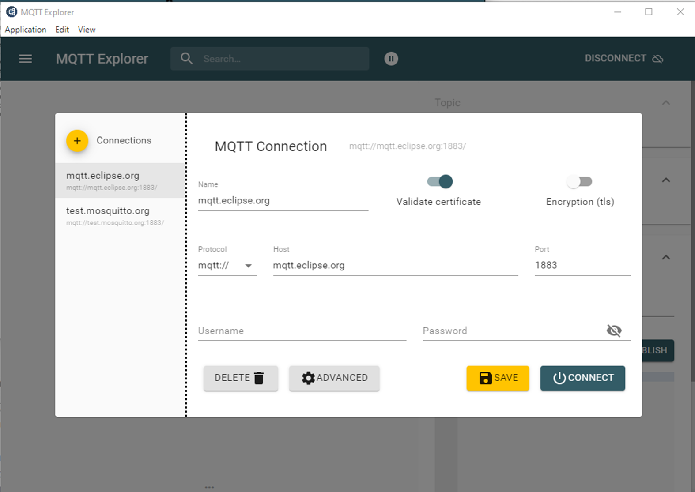
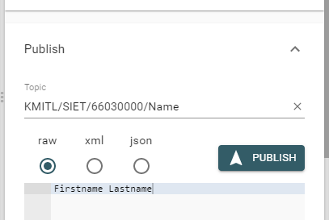
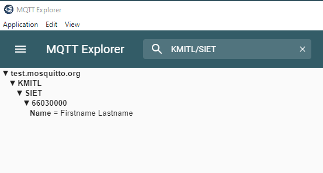
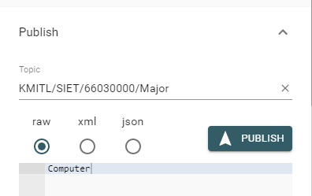
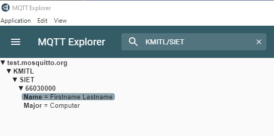
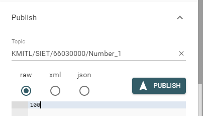
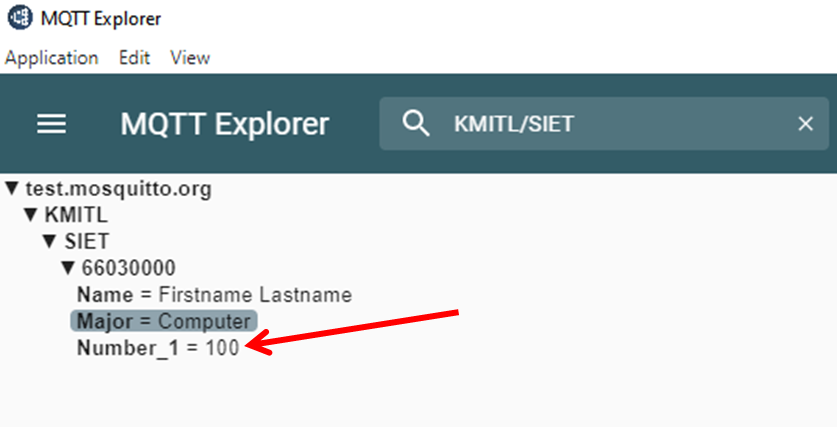
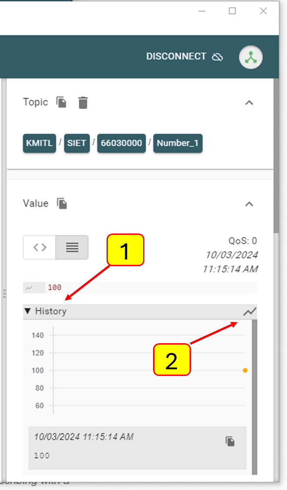
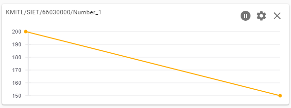

# การทดลองที่ 1 การเตรียม MQTT Client

## สิ่งที่ต้องเตรียม

###  1. MQTT clients

ดาวน์โหลดได้จากที่นี่

https://mqtt-explorer.com/

### 2. MQTT broker

เช่น test.mosquitto.org หรือ private broker อื่น ๆ

## ขั้นตอนการทดลอง

1. ติดตั้งโปรแกรม MQTT Explorer
2. เรียกใช้โปรแกรม MQTT Explorer
3. เลือก MQTT Broker ตัวอย่างเช่น
   1. mqtt.eclipse.org
   2. test.mosquitto.org

4. กำหนดค่าต่าง ๆ
   1. Name : ชื่อ broker (ตรงนี้เป็นชื่อที่จดจำง่าย ไม่ใช่ url) 
   2. Protocol : mqtt://
   3. Host : ชื่อ Host (url)
   4. Port : 1883 (mqtt port ชนิดทั่วไป ไม่ secure)
   5. Username : ยังไม่ต้องใส่
   6. Password : ยังไม่ต้องใส่
5. กด CONNECT

6. เมื่อเชื่อมต่อได้ จะปรากฏ broker จำนวนมาก เนื่องจากเป็น broker ที่ไม่มีค่าใช้จ่าย จึงมีผู้สนใจเข้ามาทดสอบจำนวนบาก และอาจจะใช้งานจริงระยะยาว

7. ทดสอบการ publist ข่าวสารด้วยโปรแกรม MQTT Explorer
    1. ในช่อง publish ใส่ชื่อ topic
    2. ใต้ช่อง publish ใส่ข่าวสารที่ต้องการส่ง 
    3. กด PUBLISH

### หมายเหตุ เนื่องจากมีผู้ใช้จำนวนมาก เราอาจจะหลุดจาก broker เป็นบางครั้งคราว

8. ค้นหา topic ที่ได้ PUBLISH ไปแล้ว
   1. ที่ช่องค้นหา ใส่ชื่อ topic ที่ต้องการค้นหา
   2. ตรวจสอบว่าข่าวสารที่ส่งไปนั้น Broker ได้รับหรือไม่
        

9. ทดลองส่ง topic อื่นๆ ภายใต้ root topic เดียวกัน
   1. แก้ไขชื่อ topic
        
   2. กด PUBLISH
   3. ตรวจสอบข่าวสารที่ได้ publich ออกไป
        

10. ทดสอบการส่งข่าวสารแบบตัวเลข
    1. แก้ไข topic
        
    1. ตรวจสอบข่าวสารที่ส่งไป
        
    1. คลิกที่ช่อง History แล้วคลิกที่ปุ่ม `Add to chart panel`
        
    จะปรากฏ chart เส้น ขึ้นมา
    
    1. ให้ลอง publish ตัวเลขค่าอื่นๆ ลงไป จะเห็นว่าโปรแกรม MQTT Explorer จะทำการ update chart ตามที่เรา publish ค่าขึ้นไปยัง topic นั้
11. ทำการทดลองซ้ำตามข้อ 10 แต่เปลี่ยนชื่อ topic โดยเปลี่ยนชื่อตัวเลขด้านท้ายสุดจาก Number_1 เป็น Number_2 แล้วเพิ่ม chart และ update ค่าตัวเลขสลับกันทั้งคู่
    1.  โปรแกรมสามารถแสดง chart ได้อย่างถูกต้องหรือไม่
12. ถ้าทุกอย่างถูกต้องตามที่คาดการณ์ ในการทดลองต่อไป เราจะส่งเลขเหล่านี้ด้วย ESP32

## ผลการทำงาน ผลการทดลอง

 
