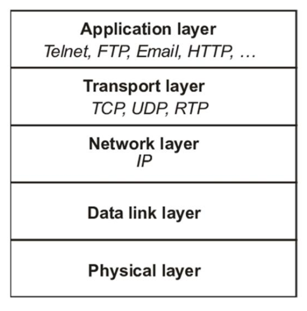
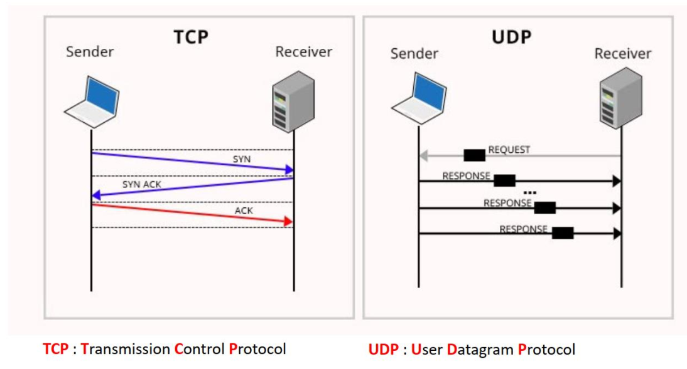
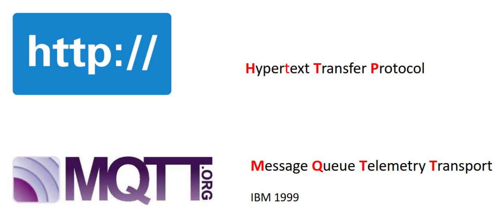
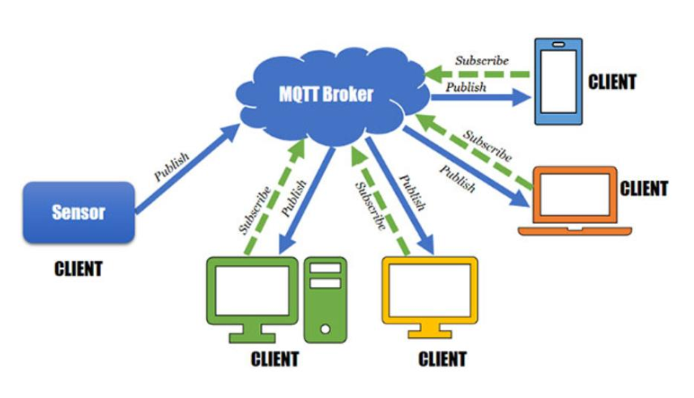
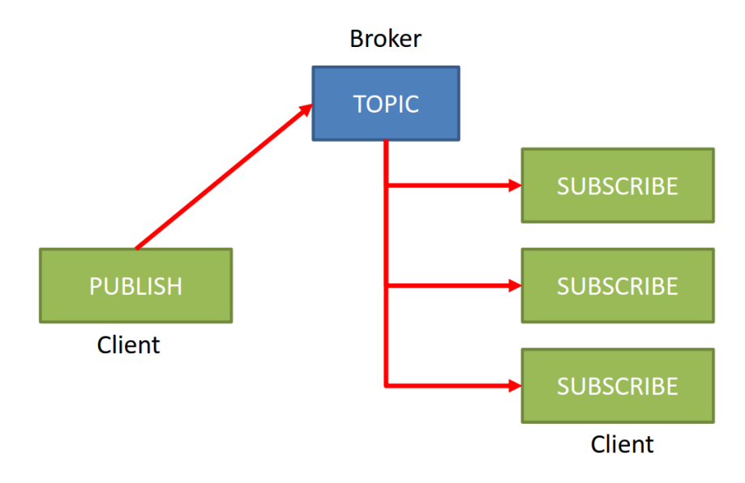

# MQTT

## MQTT คืออะไร
MQTT (Message Queuing Telemetry Transport) เป็นโปรโตคอลการส่งข้อความที่ใช้ pattern ในรูปแบบ  publish-subscribe ทำงานบน tcp layer ของ  internet layer

MQTT ถูกออกแบบมาให้มีน้ำหนักเบา มี overhead ต่ำ เนื่องจากไม่ต้องส่ง header เช่นเดียวกับโพรโคตอลที่นิยมใช้เช่น http แต่มีความน่าเชื่อถือสูง

เทคโนโลยี MQTT เหมาะที่จะใช้กับเครือข่ายที่มีข้อจำกัดเช่น มี bandwidth ต่ำ ความน่าเชื่อถือต่ำ เวลาหน่วงสูง 

MQTT นิยมใช้ในระบบ IoT เนื่องจากมีประสิทธิภาพสูง เมื่อนำมาใช้เชื่อมโยงโลกกายภาพ (physical) เข้ากับโลกอินเทอร์เน็ต (cyber) สามารถรับค่ากายภาพจากอินพุตทางเข้ามายังอินเทอร์เน็ต และควบคุมอุปกรณ์ทางกายภาพได้อย่างมีประสิทธิภาพ  

## ข้อดีของโพโตคอล MQTT 

MQTT จัดเป็นหนึ่งในโพรโตคอล IoT ที่ดีที่สุด เนื่องจากมีคุณสมบัติและความสามารถเฉพาะตัวที่ปรับให้เหมาะกับ IoT ได้ง่าย 

### น้ำหนักเบา
อุปกรณ์ IoT มีข้อจำกัดในแง่ของพลังงานของแหล่งจ่าย ความสามารถในการประมวลผล ปริมาณหน่วยความจำ และพลังงานของภาครับส่ง 

MQTT มีขนาดแพ็กเก็ตที่เล็ก ทำให้ประหยัดแบนด์วิธและพลังงาน ทำให้การสื่อสารยังคงมีประสิท๔ิภาพภายใต้ข้อจำกัดอย่างใดอย่างหนึ่งหรือทุกอย่างรวมกัน 

### ความน่าเชื่อถือ
โดยทั่วไปอุปกรณ์ IoT มักถูกออกแบบให้มีขนาดเล็กและทำงานเป็นเครือข่ายรวมกันเป็นจำนวนมาก ซึ่งส่งผลต่อปริมาณข้อมูลที่ใช้ในการสื่อสาร เป็นผลให้เสถียรภาพของระบบสื่อสารลดลง 

MQTT ถูกออกแบบให้ทำงานได้ในสภาวะที่เครือข่ายไม่มีเสถียรภาพ เช่นขาดการเชื่อมต่อบางส่วนหรือโดยสิ้นเชิง MQTT รองรับ QoS ในระดับต่าง ๆ ช่วยให้มั่นใจได้ว่าข้อความจะถูกส่งถึงผู้รับอย่างน่าเชื่อถือแม้ในสภาวะที่ท้าทาย 

### ความปลอดภัยในการสื่อสาร

ข้อมูลที่ส่งผ่านเครือข่าย IoT มักจะเป็นข้อมูลที่ละเอียดอ่อน และมีความสำคัญต่อธุรกิจของผู้ใช้ ถ้าข้อมูลเหล่านั้นถูกดักจับหรือเปลี่ยนแปลงระหว่างเส้นทาง อาจสร้างความเสียหายในปริมาณมาก

MQTT รองรับการเข้ารหัสแบบ Transport Layer Security (TLS) และ Secure Sockets Layer (SSL) ช่วยให้มั่นใจได้ว่าข้อมูลจะเป็นความลับตลอดระยะทางในการส่งข้อมูล 

MQTT รองรับกลไก การตรวจสอบสิทธิ์และการอนุญาตผ่านข้อมูลประจำตัวชื่อผู้ใช้/รหัสผ่านหรือใบรับรองไคลเอนต์ เพื่อปกป้องการเข้าถึงเครือข่ายและทรัพยากรของเครือข่าย

### การทำงานแบบสองทิศทาง

MQTT ใช้สถาปัตยกรรมแบบ Publisher/Subscriber ทำให้สามารถส่งข้อมูลในสองทิศทางได้อย่างราบรื่น

ระบบ IoT สามารถใช้งาน MQTT ผ่านการลงทะเบียนบอกรับข่าวสารผ่าน broker ในหัวข้อ (topic) ที่สนใจ หรือส่งข้อความ (publish)ผ่านหัวข้อที่มีผู้บอกรับ (subscriber) ไว้

อุปกรณ์ใหม่ ที่เข้าร่วมเครือข่ายสามารถบอกรับข่าวสารตามหัวข้อที่ต้องการได้ทันที โดยไม่ต้องทำการ config ใดๆ ที่ MQTT Broker

### เซสชันที่มีสถานะต่อเนื่อง
MQTT ช่วยให้ client สามารถรักษาเซสชันที่มีสถานะกับ broker เอาไว้ได้ ให้ระบบสามารถจดจำการสมัครรับข้อมูลและข้อความที่ไม่ได้ส่งถึงแม้จะการเชื่อมต่อจะถูกตัดขาด 

ในระบบที่มีการขาดหายของเส้นทางการสื่อสารบ่อย ๆ นั้น เราสามารถระบุเวลาคงสถานะ ทำให้ broker คอยตรวจสอบการเชื่อมต่อเป็นระยะ

หากการเชื่อมต่อขาดหายเป็นเวลานาน broker จะเก็บข่าวสารที่ยังไม่ได้ส่งถึงแลายทางไว้ให้ (ขึ้นอยู่กับระดับ QoS) และพยายามส่งเมื่อ client เชื่อมต่อได้ใหม่  เป็นวิธีการที่เพิ่มความน่าเชื่อถือและลดความเสี่ยงของการสูญเสียข้อมูลเนื่องจากการเชื่อมต่อที่ไม่ต่อเนื่อง

### รองรับอุปกรณ์ IoT ขนาดใหญ่

ระบบ IoT มักจะมีอุปกรณ์จำนวนมากเข้ามาเกี่ยวข้อง ซึ่งต้องการโพรโตคอลที่สามารถจัดการการใช้งานขนาดใหญ่ได้

ลักษณะเฉพาะของ MQTT ที่มีน้ำหนักเบา ใช้แบนด์วิดท์ต่ำ และใช้ทรัพยากรอย่างมีประสิทธิภาพทำให้ MQTT เหมาะอย่างยิ่งสำหรับแอปพลิเคชัน IoT ขนาดใหญ่ 

MQTT ได้แยกผู้รับและผู้ส่งออกจากกันอย่างเด็ดขาด ผ่านสถาปัตยกรรม publisher/subscriber (แม้แต่ในอุปกรณ์ชิ้นเดียวกันก็รองรับใช้สถาปัตยกรรมนี้ ทั้ง publisher และ subscriber) ทำให้สามารถส่งข่าวสารหาผู้รับจำนวนมากในการ publish แต่ละหัวข้อในแต่ละครั้ง

### รองรับภาษาโปรแกรมที่หลากหลาย

MQTT รองรับภาษาโปรแกรมที่หลากหลาย เช่น C, C++, C#,  PHP, Node.js, Python, Golang, Node.js และภาษาโปรแกรมอื่น ๆ

## ศึกษาเพิ่มเติม

+ [โพรโตคอล MQTT เทียบกับโพรโตคอลอื่น ๆ ](https://www.emqx.com/en/blog/what-is-the-mqtt-protocol)

+ [MQTT คืออะไร](https://aws.amazon.com/th/what-is/mqtt/)
